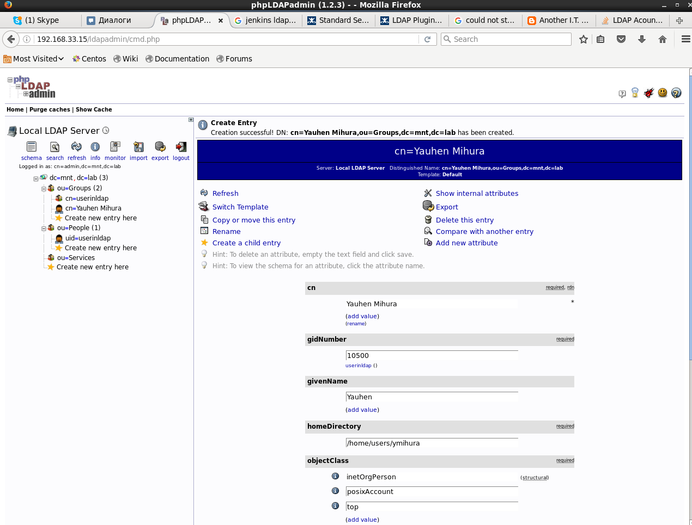
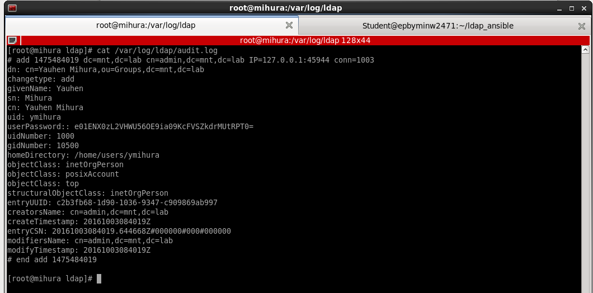
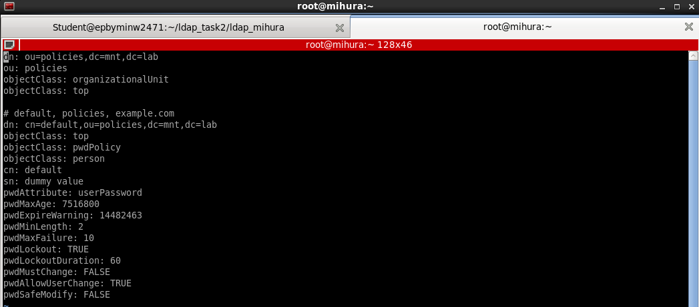
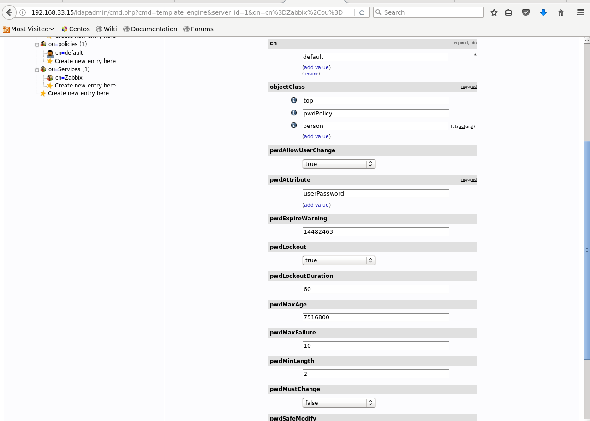
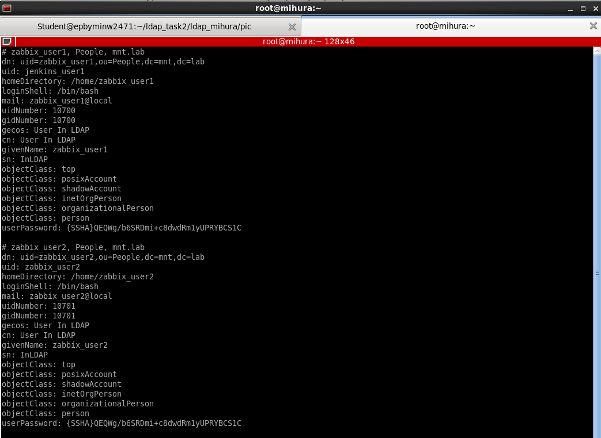
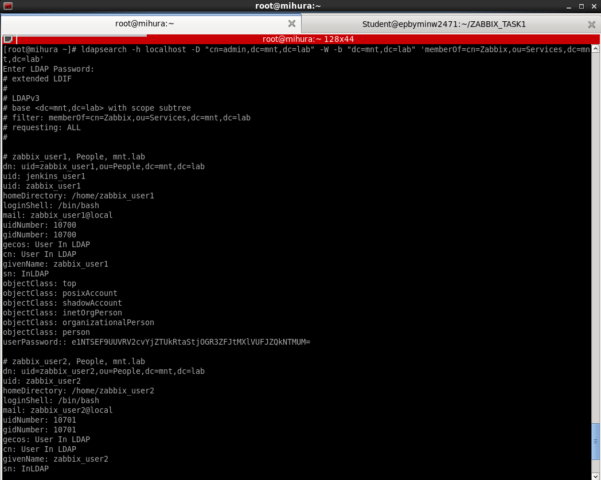
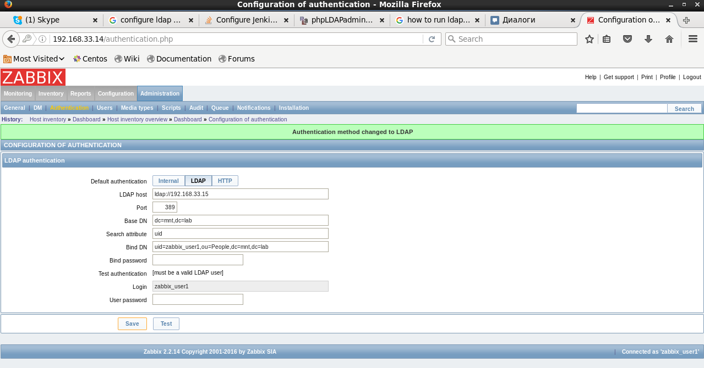
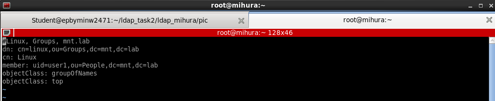
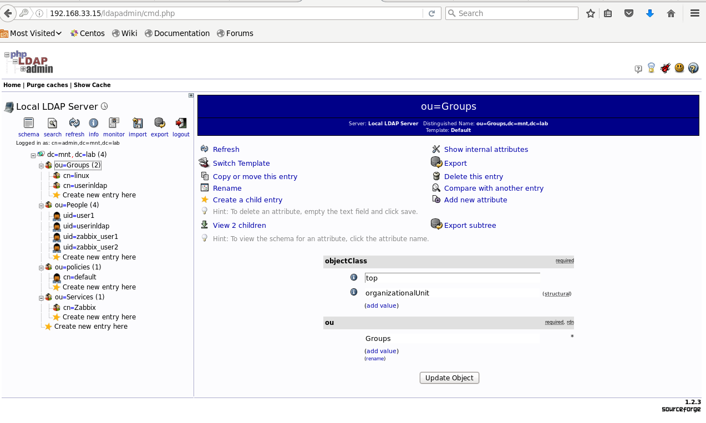
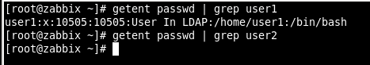

# Task2 ldap_mihura

 <b>1. Configure Audit logging</b> 
Added in /etc/openldap/slapd.conf
### Audit Log
moduleload auditlog.la
overlay auditlog
auditlog /var/log/ldap/audit.log
###
Then created user and check

 <b>2. Configure Password Policy</b> 

and use
ldapadd -x -D "cn=admin,dc=mnt,dc=lab" -W -f /etc/openldap/ldap-policy.ldif

 <b>3. Create groupOfNames Jenkins and Zabbix. Add users into these groups.</b> 

Edit /etc/nslcd.conf:
filter passwd (&(objectClass=posixAccount)(memberOf=cn=Linux,ou=Groups,dc=mnt,dc=lab))

$ authconfig --enableldap --enableldapauth --ldapserver=ldap://192.168.33.15/ --ldapbasedn=dc=mnt,dc=lab --disablefingerprint --kickstart --enablemkhomedir

