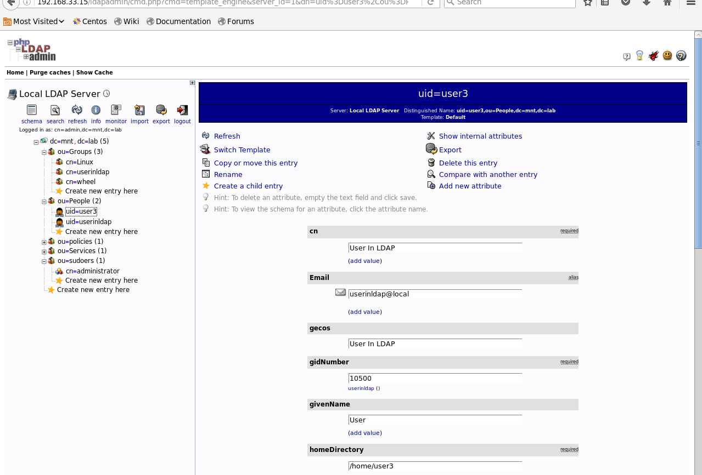
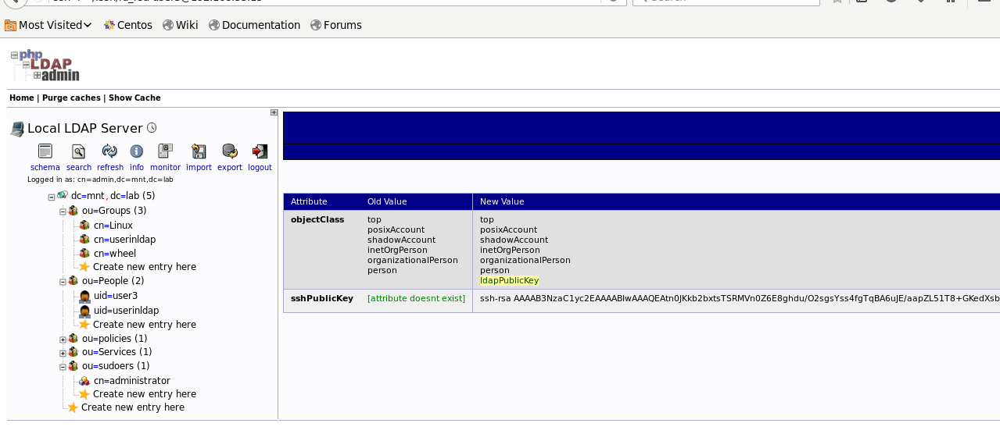
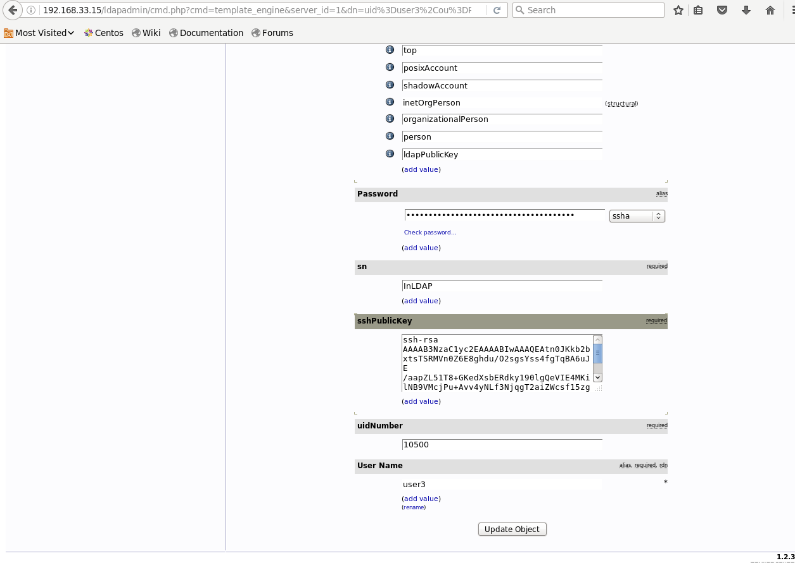
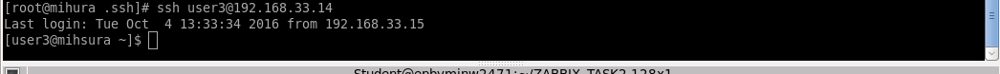

#TASK1 LDAP_MIHURA

1. Screenshot of user first time login into the system (with password)
2. Screenshot of user login into the system (with ssh keys)
3. Screenshot of user groups details
4. Screenshot of execution any command as root via sudo

